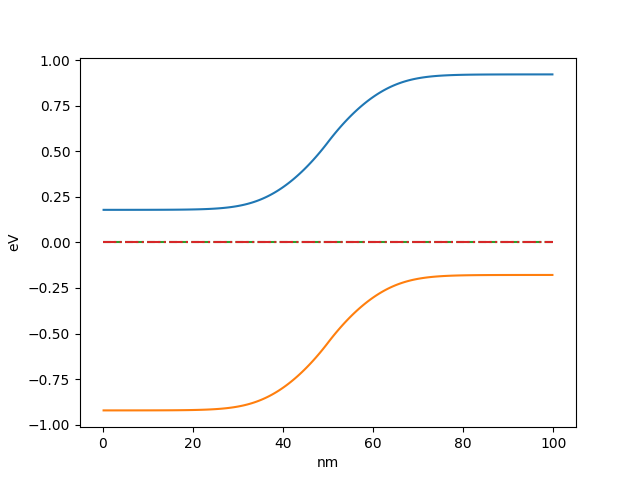

Tutorial: PN junction
=====================

In this tutorial a simple model of PN junction will be constructed. The same model is used in example included in oedes distribution in file ``examples/interactive/pn.ipynb``. 

Before starting, ``oedes`` package must be imported

.. doctest::

   >>> import oedes


``oedes`` contains models of typical devices. However, for the purpose of this tutorial the model will be constructed equation-by-equation.

The drift-diffusion system
--------------------------

For simulating transport, a model of temperature distribution must be assumed. In the simplest case of `isothermal simulation`, the same effective temperature is assumed everywhere inside the device and for all carriers. The model is created as follows:

.. doctest::

   >>> temperature = oedes.models.ConstTemperature()

Note that the specification of model is separated from the specification of parameters. The actual value of temperature, in Kelvins, is given as parameter. 

The next step is to create Poisson's equation of electrostatics

.. doctest::

   >>> poisson = oedes.models.PoissonEquation()

Constructed objects `poisson` and `temperature` must be passed as arguments when creating transport equations:

.. doctest::

   >>> electron = oedes.models.equations.BandTransport(poisson=poisson, name='electron', z=-1, thermal=temperature)
   >>> hole = oedes.models.equations.BandTransport(poisson=poisson, name='hole', z=1, thermal=temperature)

Above creates two conventional drift-diffusion equations for electrons and holes respectively. By default, the mobility is assumed constant and the DOS is assumed to be Boltzmann approximation. `name` arguments give prefixes which will be used to give values of physical arguments and to access outputs of the model. `z` are charges of species expressed in elementary charge. `oedes` allows arbitrary number of species, and arbitrary values of `name` and `z`. This allows to construct complicated models taking into account for example mixed ionic-electronic transport.

The doping profile
------------------

To model the PN junction, a doping profile must be defined. In the example, left half of the device is doped with ionized donor concentration given by parameter ``Nd``, and right half of device is doped with doped with ionized acceptor concentration given by parameter ``Na``. 

.. doctest::

   >>> def pn_doping(mesh, ctx, eq):
   ...     return oedes.ad.where(mesh.x<mesh.length*0.5,ctx.param(eq, 'Nd'),- ctx.param(eq, 'Na'))
   >>> doping = oedes.models.FixedCharge(poisson, density=pn_doping)

The dopants are assumed to be fully ionized and therefore it is modeled as fixed charge. The FixedCharge adds calculated doping profile to the Poisson's equation.

The ``pn_doping`` function is called during model evaluation and is given as parameters the mesh, the evaluation context object `ctx`, and the discretized  equation object `eq`. In the example, it uses `ctx` object to access parameters for `eq`, the dopant concentations.

Note that a specialized version of function `where` is used instead of numpy version. This should be done, as it allows automatic differentiation with respect to arguments. It is not strictly required in this example, but, for obtaining solution, the output must be automatically differentiable with respect to unknown vector by ``sparsegrad``.

The Ohmic contacts
------------------

To keep the example simple, Ohmic contacts are assumed on both sides of the device. They are created as follows:

.. doctest::

   >>> semiconductor = oedes.models.Electroneutrality([electron, hole, doping],name='semiconductor')
   >>> anode = oedes.models.OhmicContact(poisson, semiconductor, 'electrode0')
   >>> cathode = oedes.models.OhmicContact(poisson, semiconductor, 'electrode1')

Ohmic contacts require knowledge of equilibrium charge carrier concentrations in semiconductor. This is calculated by ``Electroneutrality``. Note that since concentrations in `doped` semiconductor are of interest, all charged species are passed to Electroneutrality. `electrode0` and `electrode1` refers to names of boundaries of the mesh.

Putting all together
--------------------

To avoid divergence of the simulation due to infinitely large lifetime of electrons and holes, it is recommended to add recombination to the model

.. doctest::

   >>> recombination = oedes.models.DirectRecombination(semiconductor)

Lastly, the calculation of terminal current is a non-trivial post-processing step. It is recommended to use Ramo-Shockley current calculation in most cases, which is created

.. doctest::

   >>> current = oedes.models.RamoShockleyCurrentCalculation([poisson])

The discrete model is constructed and initialized as follows

.. doctest::

   >>> parts = [ poisson, temperature, electron, hole, doping, current, semiconductor, anode, cathode, recombination ]
   >>> mesh = oedes.fvm.mesh1d(100e-9)
   >>> model = oedes.fvm.discretize(parts, mesh)

Parameters
----------

The physical parameters are provided as ``dict``.

.. doctest::

    >>> params={
    ...     'T':300,
    ...     'epsilon_r':12,
    ...     'Na':1e24,
    ...     'Nd':1e24,
    ...     'hole.mu':1,
    ...     'electron.mu':1,
    ...     'hole.level':1.1,
    ...     'electron.level':0,
    ...     'electrode0.voltage':0,
    ...     'electrode1.voltage':0,
    ...     'hole.N0':1e27,
    ...     'electron.N0':1e27,
    ...     'beta':1e-9
    ... }

Above, ``T`` is temperature in Kelvins. It is used by ``ConstTemperature`` object. ``epsilon_r`` is the relative dielectric permittivity. It is used by ``PoissonEquation`` object. ``Na`` and ``Nd`` are parameters accessed by ``pn_doping`` function, the concentrations of dopants. ``beta`` is used by ``DirectRecombination``.

Other parameters are in form ``name.parameter``. ``name`` is passed to the equation, and they can be nested. If, for example, you transported species would be created as

.. code-block:: python

   something = oedes.models.BandTransport(name='zzz',...)

then the corresponding mobility parameter would be ``zzz.mu```.

The mobilities ``electron.mu`` and ``hole.mu`` are given in :math:`\mathrm{m^2 / (V s)}`, therefore are equal to 1000 :math:`\mathrm{cm^2 (V s)}` each. In the example above, instead of specifying electron affinity and band-gap, the energies of both bands are specified directly in `level` parameters, in eV. The voltages are applied to Ohmic contacts are specified by ``electrode0.voltage`` and ``electrode1.voltage``, in Volts.  ``N0`` denotes the total density of states, in :math:`\mathrm{1/m^3}`.

params
~~~~~~

`params` is a dictionary of parameter values. Keys which are specific to part of the model start with a prefix, which refers to species name and also the layer. All numeric values are given in SI base units, except for small energies which are specified in eV.

Summary of most common parameters is given below (`*` denotes prefix):

- `T` [K]: ambient temperature in fixed temperature simulation
- `*.mu` [m^2/(Vs)]: charge carrier mobility, `*` is charge carrier
- `*.level` [V]: HOMO/LUMO level, -E/e, `*` is charge carrier
- `*.voltage` [V]: applied voltage, `*` is electrode
- `*.N0` [1/(m^3)]: total density of states, `*` is electronic charge carrier
- `*.workfunction` [V]: workfunction divided by elementary charge W/e, `*` is electrode 
- `npi` [1/(m^6)]: intrinsic product of electron and hole concentration

Currently, no default values are assumed and calculation fails if any parameter is not specified.


Solving
-------

``oedes`` `context` objects binds models with their parameters and solutions. It also provides facilities for solving, post-processing and plotting the data.

To obtain solution for parameters listed above

.. doctest::

   >>> c = oedes.context(model)
   >>> c.solve(params)

Examining output
----------------

The solution can be investigated by calling `output` function, which returns a dict of available outputs:

.. doctest::

   >>> out=c.output()
   >>> print(sorted(out.keys()))
   ['.meta', 'D', 'Dt', 'E', 'Et', 'J', 'R', 'electrode0.J', 'electrode1.J', 'electron.Eband', 'electron.Ef', 'electron.J', 'electron.Jdiff', 'electron.Jdrift', 'electron.c', 'electron.ct', 'electron.j', 'electron.jdiff', 'electron.jdrift', 'electron.phi_band', 'electron.phi_f', 'hole.Eband', 'hole.Ef', 'hole.J', 'hole.Jdiff', 'hole.Jdrift', 'hole.c', 'hole.ct', 'hole.j', 'hole.jdiff', 'hole.jdrift', 'hole.phi_band', 'hole.phi_f', 'potential', 'semiconductor.Ef', 'semiconductor.electron.c', 'semiconductor.hole.c', 'total_charge_density']

The outputs are `numpy` arrays. For example, the electrostatic potential is

.. doctest::
   :options: +ELLIPSIS, +NORMALIZE_WHITESPACE

   >>> print(out['potential'])
   [-0.17857923 -0.17858006 -0.17858115 -0.17858258 -0.17858445 -0.17858693
     -0.17859023 -0.17859468 -0.1785994  -0.17860442 -0.17860982 -0.17861567
     ...
     -0.92141696 -0.92141772]

To access additional information about output (such as its mesh), use ``.meta`` subdictionary.

.. doctest::
   :options: +ELLIPSIS, +NORMALIZE_WHITESPACE

   >>> out['.meta']['potential']
   OutputMeta(mesh=<oedes.fvm.mesh.mesh1d object at ...>, face=False, unit='V')

outputs
~~~~~~~

Summary of the most important outputs is given below (`*` denotes `prefix`):

- `*.c` [1/m^3]: concentration of species `*`, for each cell
- `*.ct` [1/(m^3 s)]: time derivative of concentration of species `*`, for each cell
- `*.j` [1/(m^2 s)]: flux of species `*`, for each face
- `*.jdrift` [1/(m^2 s)]: drift (advection) part of flux of species `*`, for each face
- `*.jdiff` [1/(m^2 s)]: diffusion (advection) part of flux of species `*`, for each face
- `R` [1/(m^3 s)]: recombination density, for each cell
- `J` [A/m^2]: total electric current density
- `E` [V/m]: electric field, for each face
- `*.potential` [V]: electrostatic potential, for each cell

Plotting
--------

.. doctest::

   >>> import matplotlib.pylab as plt
   >>> fig,ax = plt.subplots()
   >>> p=c.mpl(fig, ax)
   >>> p.plot(['electron.Eband'],label='$E_c$')
   >>> p.plot(['hole.Eband'],label='$E_v$')
   >>> p.plot(['electron.Ef'],linestyle='--',label='$E_{Fn}$')
   >>> p.plot(['hole.Ef'],linestyle='-.',label='$E_{Fp}$')
   >>> p.apply_settings({'xunit':'n','xlabel':'nm'})

.. doctest::
   :hide:

   >>> fig.savefig('fig/tutorial-pn.png')



